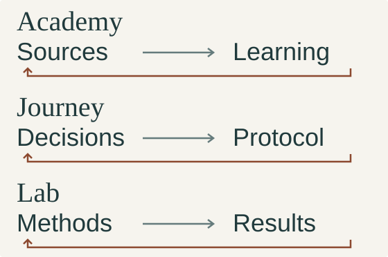

# Pietro Corona

**Public health · Epidemiology · Software & AI for research**

Building **[Weavidence](#weavidence)**. `VaX1989` is my technical handle.

My route into software and AI began in public health: surveillance, health-information systems and epidemiological analysis. I also teach on contract at the [University of Cagliari](https://web.unica.it/unica/page/it/pietro_corona).

[Weavidence](#weavidence) · [Selected systems](#selected-systems) · [Writing](#writing)

## Weavidence

I am developing **Weavidence** as an independent set of tools for learning research methods, designing studies and inspecting how analytical results were produced.

**Academy** keeps learning connected to source versions and assessment evidence. **Journey** makes research-design decisions explicit and revision-bound. **Lab** keeps analytical outputs connected to datasets, transformations, methods and review context.

<picture>
  <source media="(prefers-color-scheme: dark)" srcset="assets/research-dark.svg">
  <source media="(prefers-color-scheme: light)" srcset="assets/research-light.svg">
  
</picture>

Three paths, each with a way back to what produced the output. *System sketch, not a product screenshot or a claim that the three products share one release state.*

**Active development.** The product surfaces have different engineering states. Internal testing is not external scientific review, validation, adoption or production readiness.

[Explore Weavidence](https://www.weavidence.com/)

What those three paths preserve

**Academy:** viewing material, practising, passing an assessment and demonstrating a capability are different events. Learning and assessment stay tied to the source and design versions that produced them.

**Journey:** decisions, findings and exports refer to a particular protocol revision. Human confirmation and reasoned overrides remain explicit; fluent generated text is not methodological authority. The current repository describes a local beta, not a qualified hosted service.

**Lab:** an analytical result needs its dataset, transformations and analytical context. Generated explanations are separate from the computations they describe. Runtime verification varies by capability.

## Selected systems

### NOIA / FIELD

A persistent stealth-investigation game in which evidence has to survive contact with the world. The player's **Subject** follows signals into questions and **Casefiles**, then into **FIELD**: NOIA's embodied physical-operation layer, not a separate game.

**Signal → Question → Casefile → FIELD → Evidence → accepted consequence**  
↳ Custody, provenance and changes to the Subject and world remain inspectable.

A shutter can break a sightline and make a sound. What is recovered, who has custody and what the operation establishes can alter later possibilities.

**Private development.**

OPTIC, WINDOW / EventWeave and FIELD

**OPTIC** holds the Subject's inquiry and personal continuity. **WINDOW** makes the world interpretable; **EventWeave** is a rebuildable causal/provenance projection, not the authority for persistent state.

A version-pinned **OperationManifest** defines the operation context. FIELD produces an **OperationResult**; NOIA accepts and reconciles it before persistent custody and consequences change. The player cannot simply declare the outcome.

Sensing, observations and evidence constrain what a seeker can know. Hidden world state is not a shortcut to an omniscient opponent.

### One File Universe

A persistent, multiscale reality distributed as **one deterministic HTML file**, built from modular source. Its sparse graph separates stable identities from the views materialized for exploration.

**Stable identity → bounded materialization → view → replay**  
↳ Canonical history, provenance and model authority survive a discarded view.

**Experimental.** [Source, build instructions and limits](https://github.com/VaX1989/One_File_Universe).

### Personae

Local-first, model-independent infrastructure for a persistent digital **Person**. A proposed change can be reviewed without changing the Person; only an authorized accepted event extends canonical history.

**Proposal → review → authorized acceptance → accepted history**  
↳ Provenance, event time, recorded time and authority remain distinguishable.

Memory, provenance and model output do not automatically become truth.

**Private experimental development.**

Personae: temporal and authority boundaries

The temporal model distinguishes when an event occurred from when it was recorded. Interoperability contracts remain distinct from their implementations. Capability is not authorization, and delivery order is not accepted history. The Person format is experimental, not an approved standard.

## Writing

### Elements of Population Health

A **21-volume independent population-health series** connecting epidemiological methods, public-health practice and the institutions in which decisions are made. Its editorial architecture keeps sources, claims, manuscripts and editions distinct.

I use AI for source discovery, argument structure, first drafts, revision, translation, bibliographic checking, editing and production. I direct the work and remain responsible for reading, verification, correction and final editorial judgment. **The books have not undergone external peer review.**

### Tempo. Libero.

An essay about technology, acceleration and the difference between time saved and the freedom to change direction.

[Books and author page](https://www.amazon.it/-/en/stores/author/B0GGMQBW3X/about)

---

Professional context and how I work

My current formal healthcare role is **Assistente Sanitario at ASL Cagliari**. My work has included surveillance, health-information flows and quantitative analysis.

From May 2024 to June 2025, I held a separate appointment as **Esperto epidemiologo** at Sardinia's Regional Epidemiological Observatory. My current healthcare role and contract teaching are distinct from these independent projects; they do not imply institutional endorsement.

I use AI extensively in software design, coding and review. Its output is not independent validation. Product decisions, correction and release responsibility remain mine.

For research methods, technical review or collaboration: **[LinkedIn](https://it.linkedin.com/in/pietro-corona-020959108)**.
