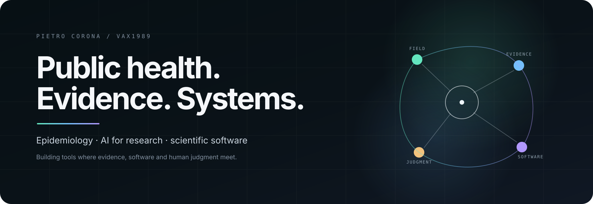
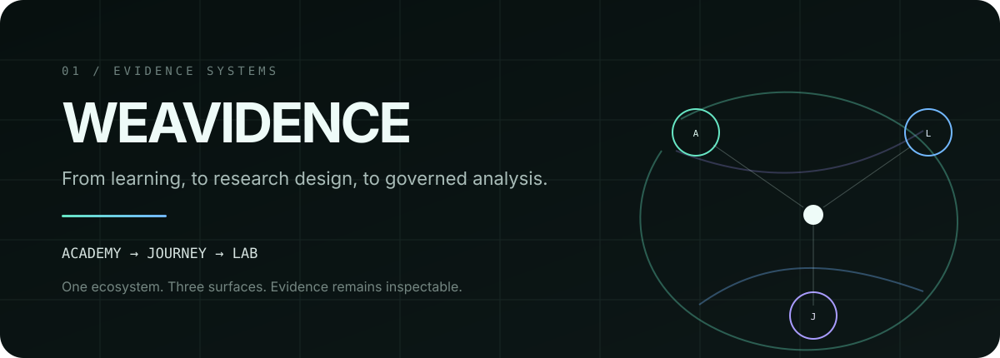
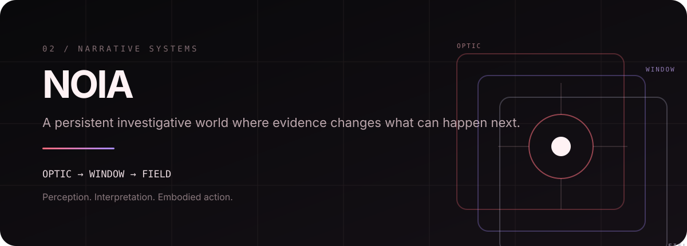
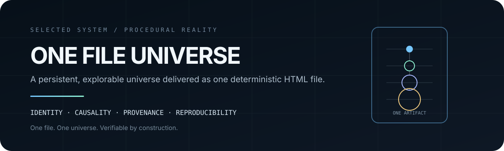
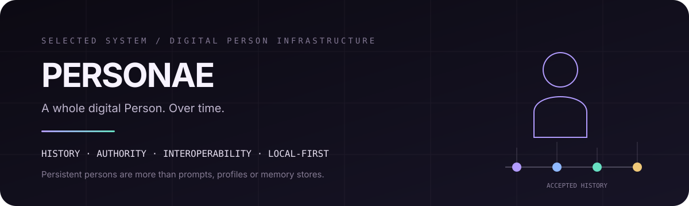
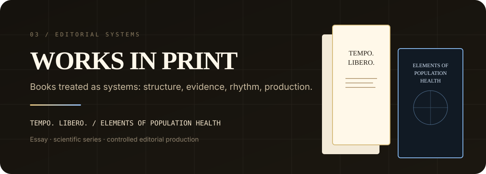

<p align="center">
  
</p>

<h1 align="center">Pietro Corona</h1>

<p align="center">
  <strong>Public health · Epidemiology · AI for research · Evidence systems</strong>
</p>

<p align="center">
  Public-health professional, epidemiology practitioner and adjunct university lecturer.<br/>
  I build research, evidence and long-horizon software systems. <code>VaX1989</code> is my technical handle.
</p>

<p align="center">
  <a href="https://www.weavidence.com/"><strong>Weavidence</strong></a>
  &nbsp;&nbsp;·&nbsp;&nbsp;
  <a href="https://it.linkedin.com/in/pietro-corona-020959108"><strong>LinkedIn</strong></a>
  &nbsp;&nbsp;·&nbsp;&nbsp;
  <a href="https://web.unica.it/unica/page/it/pietro_corona"><strong>University of Cagliari</strong></a>
  &nbsp;&nbsp;·&nbsp;&nbsp;
  <a href="https://www.amazon.it/-/en/stores/author/B0GGMQBW3X/about"><strong>Books</strong></a>
</p>

---

## One trajectory, not several identities

My professional foundation is **public health and epidemiology**: surveillance, health-information systems, mortality, prevention, quantitative analysis, monitoring and evaluation.

Software and AI came later.

I use them because some research and evidence problems are not solved by another dashboard, another prompt or another opaque model call. They require systems that preserve **provenance, authority, uncertainty, history and human judgment** as capability grows.

That is the thread connecting my work:

```text
public health practice
        ↓
epidemiology + evidence
        ↓
research methodology
        ↓
software + AI
        ↓
governed systems
```

Today, the main expression of that trajectory is **Weavidence**.

---

<p align="center">
  
</p>

## Weavidence — flagship

**Weavidence** is my principal long-term research and product project.

It explores how research workflows can become more **traceable, reproducible, inspectable and governable**, while keeping human authority explicit.

The ecosystem is organized around three connected surfaces:

| Surface | Purpose |
|---|---|
| **Academy** | Learning structured around knowledge, evidence and demonstrated competence. |
| **Journey** | A governed path from a research question toward an auditable protocol. |
| **Lab** | Data quality, lineage, analysis, simulation and bounded AI-assisted workflows. |

> **AI may accelerate research. It should not erase provenance, uncertainty, accountability or human control.**

<p align="center">
  <a href="https://www.weavidence.com/"><strong>weavidence.com ↗</strong></a>
  &nbsp;&nbsp;·&nbsp;&nbsp;
  <a href="https://app.weavidence.com/"><strong>open Journey ↗</strong></a>
</p>

<sub><strong>Status.</strong> Weavidence is an independent project in active development. I distinguish implemented capability from external validation, adoption and scientific review.</sub>

---

## Selected systems

These are the secondary projects that best represent how I think about systems.

They are not presented as a random portfolio. Each explores a different version of the same hard problem:

> **How do you let a complex system evolve without losing truth, history, authority or consequence?**

<p align="center">
  
</p>

### NOIA / FIELD

**NOIA** is a persistent systemic investigation world built around evidence, interpretation, custody and consequence.

Its core structure spans three realities:

**OPTIC** — what the Subject knows and is trying to establish.  
**WINDOW / EventWeave** — how the world is interpreted, connected and reconstructed.  
**FIELD** — what physically happens, under causal sensing, risk and verifiable outcomes.

FIELD is not a side project attached to NOIA. It is the embodied operation layer of the same product architecture.

The design principle I care about most is simple:

> **The valuable object is not loot. It is evidence.**

NOIA / FIELD is in private development.

---

<p align="center">
  
</p>

### [One File Universe](https://github.com/VaX1989/One_File_Universe)

**One File Universe (OFU)** is an experimental engineering project for a persistent, explorable procedural universe distributed as **one deterministic HTML file**.

The source remains modular and testable; the single-file artifact is the distribution target.

The project explores:

- stable identity across scale;
- deterministic generation;
- causal continuity;
- explicit model authority;
- provenance;
- replay and reproducibility;
- bounded materialization rather than pretending the whole universe exists at once.

**One file. One universe. Verifiable by construction.**

---

<p align="center">
  
</p>

### Personae

**Personae** is local-first, model-independent infrastructure for persistent digital Persons with explicit history, authority and interoperability.

The central idea is that a digital Person should be more than a prompt, profile or memory store.

Personae separates **information from authority** and treats accepted history as a first-class system property.

Some of its governing boundaries are deliberately strict:

```text
PROVENANCE != TRUTH
MEMORY != TRUTH
CAPABILITY != AUTHORIZATION
MODEL OUTPUT != PERSON MUTATION
DELIVERY ORDER != ACCEPTED HISTORY
```

Personae is currently in private development.

---

## A common grammar

Different domains, same engineering questions.

<table>
<tr>
<td align="center" width="33%">
<strong>HUMAN AUTHORITY</strong><br/>
<sub>Tools may propose. Responsibility stays explicit.</sub>
</td>
<td align="center" width="33%">
<strong>PROVENANCE</strong><br/>
<sub>Claims, transformations and artifacts should keep their origin.</sub>
</td>
<td align="center" width="33%">
<strong>BOUNDARIES</strong><br/>
<sub>Capability, uncertainty and authority should not blur together.</sub>
</td>
</tr>
<tr>
<td align="center">
<strong>REPRODUCIBILITY</strong><br/>
<sub>Important results should be inspectable again.</sub>
</td>
<td align="center">
<strong>CONTINUITY</strong><br/>
<sub>Identity and history should survive system evolution.</sub>
</td>
<td align="center">
<strong>CRAFT</strong><br/>
<sub>Technical rigor deserves a deliberate surface.</sub>
</td>
</tr>
</table>

---

<p align="center">
  
</p>

## Editorial work

Writing is another way I build systems.

### Elements of Population Health

**Elements of Population Health** is a **21-volume independent series** spanning epidemiology, public health, health systems, digital health, implementation, ethics, law, preparedness and related areas.

The project is also an experiment in large-scale knowledge architecture: claims, sources, manuscripts, editorial states and production artifacts are kept as distinct objects rather than collapsed into one opaque writing process.

The workflow is **AI-assisted and human-directed**. AI has supported source discovery, argument architecture, drafting, revision, translation, bibliographic checking, editing and production. Human reading, correction, direction and final editorial judgment remain mine.

**The books have not undergone external peer review**, and I do not present them as peer-reviewed publications.

### Tempo. Libero.

**Tempo. Libero.** is a long-form essay on the relationship between acceleration, available time, effective freedom and the possibility of changing direction.

Its central question is not whether technology can save time, but:

> **Who gets to decide what liberated time becomes?**

<p align="center">
  <a href="https://www.amazon.it/-/en/stores/author/B0GGMQBW3X/about"><strong>Author page ↗</strong></a>
</p>

---

## Professional anchor

My current formal role in the Italian National Health Service is **Assistente Sanitario (Public Health Assistant)** at **ASL Cagliari**.

My work has included epidemiological analysis, surveillance systems, health-information flows, mortality data and public-health programs.

From **May 2024 to June 2025**, I also held a separate formal assignment as **Esperto epidemiologo (Epidemiology Expert)** with the Regional Epidemiological Observatory of Sardinia.

I teach as an **adjunct lecturer at the University of Cagliari** in public-health-related subjects.

I keep this distinction explicit because **professional identity, domain expertise and formal job titles should reinforce one another without being conflated**.

---

## What this profile is — and is not

This profile is a curated front door.

It is meant to make a few things legible:

- where my domain expertise comes from;
- what I am building now;
- which secondary systems best represent my technical work;
- how I think about evidence, provenance and authority;
- where the public record can verify the professional identity behind the handle.

It is **not** a dump of every repository, experiment, prototype, fork or short-lived contribution.

If a project appears here, it is because it says something material about the work.

---

## Connect

<p align="center">
  <a href="https://www.weavidence.com/">Weavidence</a>
  &nbsp;·&nbsp;
  <a href="https://it.linkedin.com/in/pietro-corona-020959108">LinkedIn</a>
  &nbsp;·&nbsp;
  <a href="https://web.unica.it/unica/page/it/pietro_corona">University of Cagliari</a>
  &nbsp;·&nbsp;
  <a href="https://www.amazon.it/-/en/stores/author/B0GGMQBW3X/about">Books</a>
</p>

<p align="center">
  <strong>Build deeply. Keep the evidence visible. Make the boundaries explicit.</strong>
</p>
