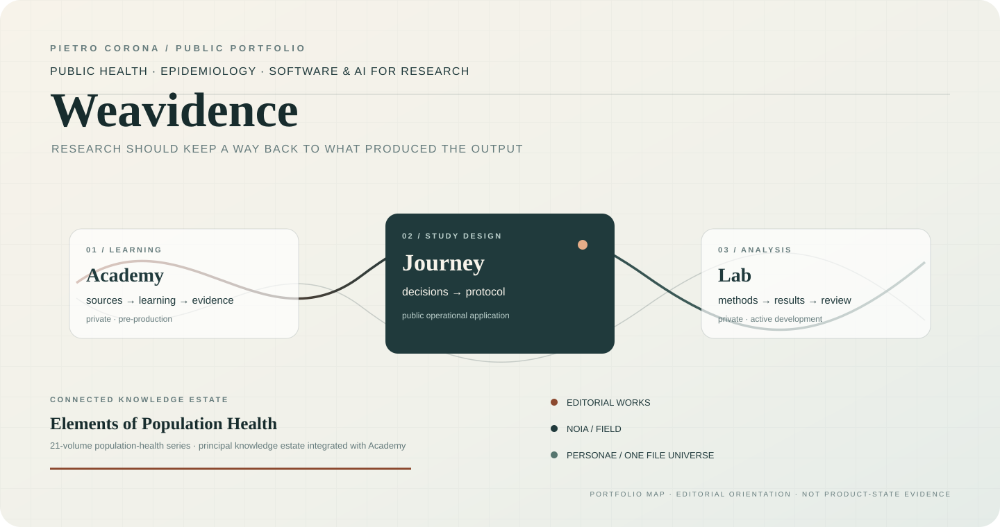
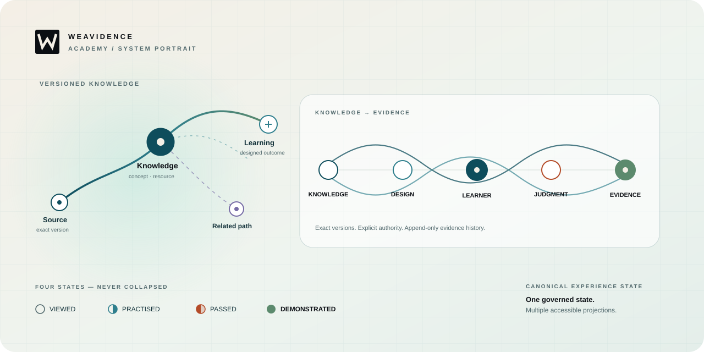
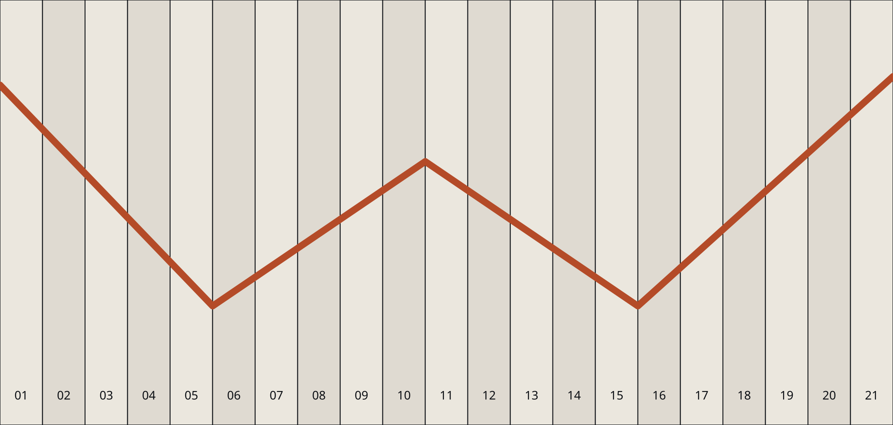
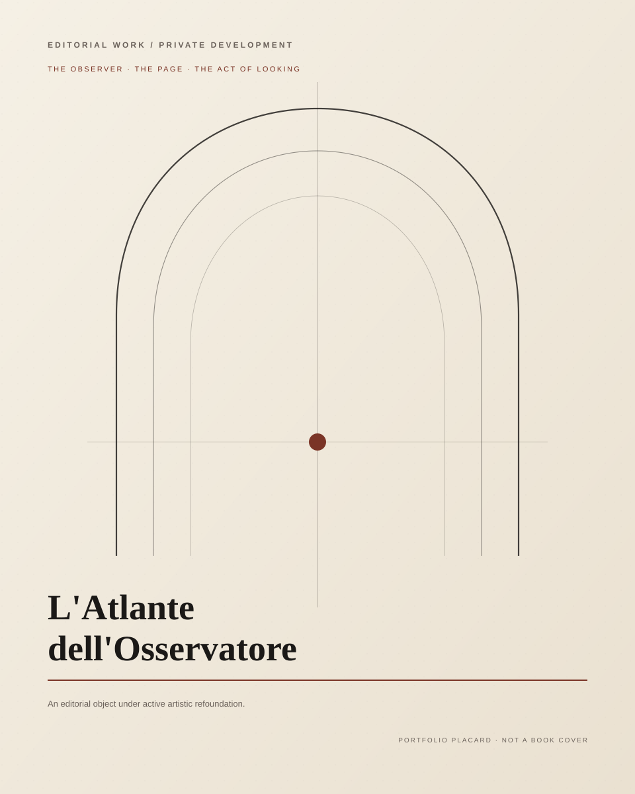
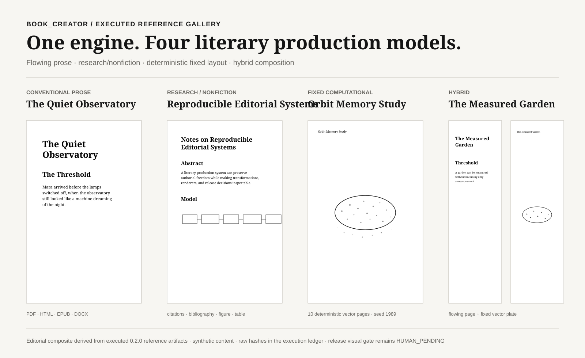
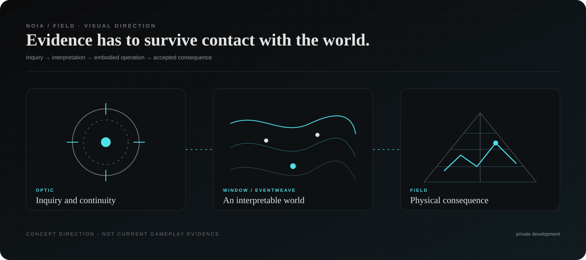
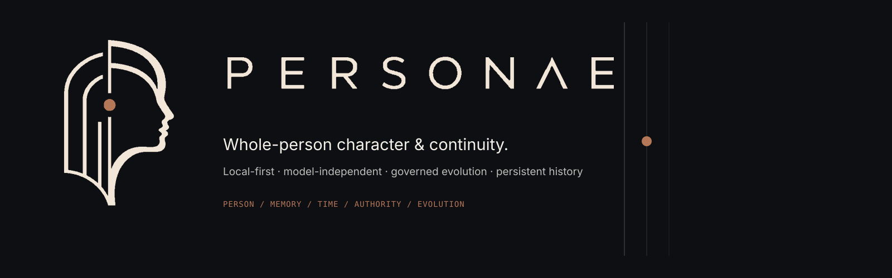
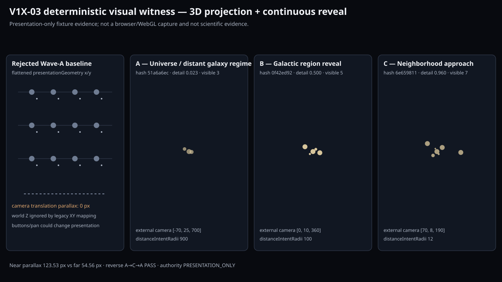

# Software, research systems, and experiments

**Shaped by public health, curiosity and AI-assisted development.**

I came to software from a different path. My background is in public health and epidemiology, but I had always wanted to build tools, systems and ideas of my own. AI-assisted development gave me a practical way to cross that gap — turning things that once remained sketches, notes or unrealized concepts into working software.

This GitHub is where those paths now meet. Some projects grow directly from my professional experience in research, epidemiology and public health. Others are deliberately exploratory: publishing systems, persistent worlds, games, digital persons and experiments I simply wanted to see exist.

What connects them is the same impulse: **learning by building, testing ideas against reality, and exploring how far a good idea can be taken.**

**Pietro Corona** · Public health & epidemiology · Building **[Weavidence](#weavidence)** · `VaX1989` is my technical handle.

[Weavidence](#weavidence) · [Elements of Population Health](#elements-of-population-health) · [Editorial works](#editorial-works--production-systems) · [NOIA / FIELD](#noia--field) · [Experimental systems](#experimental-research-systems)

  <picture>
    <source media="(prefers-color-scheme: dark)" srcset="assets/readme/profile-hero-dark.svg">
    <source media="(prefers-color-scheme: light)" srcset="assets/readme/profile-hero-light.svg">
    
  </picture>

<strong>Portfolio map.</strong> Editorial orientation, not a product-state or validation diagram.

---

## Weavidence

**Tools for learning research methods, designing studies and inspecting how analytical results were produced.**

I am developing Weavidence around a simple constraint: useful outputs should keep a route back to the sources, decisions, data, methods and review context that produced them.

| Surface | What it preserves | Current public state |
|---|---|---|
| **Landing / ecosystem** | The public map of Academy, Journey, Lab and Weavidence Insights | **Public:** [weavidence.com](https://www.weavidence.com/) |
| **Academy** | Versioned knowledge → learning design → learner action → assessment evidence | **Private, pre-production.** [Public product page](https://www.weavidence.com/academy) |
| **Journey** | Research question → explicit decisions → reviewable protocol | **Operational public application.** [Product page](https://www.weavidence.com/journey) · [Open Journey](https://app.weavidence.com/) |
| **Lab** | Dataset → transformations → methods → results → review context | **Private, active development.** [Public product page](https://www.weavidence.com/lab) |

**Journey keeps methodological authority with the researcher.** It supports research design; it is not a clinical decision system, and external scientific validation of the platform is incomplete. Academy and Lab are not presented as publicly available applications.

### Academy × EPH — from knowledge to evidence

  <picture>
    <source media="(prefers-color-scheme: dark)" srcset="assets/readme/weavidence-academy-dark.svg">
    <source media="(prefers-color-scheme: light)" srcset="assets/readme/weavidence-academy-light.svg">
    
  </picture>

<strong>Academy system portrait — not a product screenshot.</strong> Academy is private and pre-production; the visual describes current system semantics, not public availability or external validation.

**Academy** keeps viewing, practising, passing an assessment and demonstrating a capability as different events. **Journey** keeps decisions, findings and exports tied to protocol revision and explicit human confirmation. **Lab** keeps generated explanations separate from the computations and analytical context they describe.

> **Current boundary:** the Weavidence surfaces have different engineering and access states. Internal testing is not external scientific review, validation, adoption or production readiness.

---

## Elements of Population Health

### The knowledge estate connected to Weavidence Academy

**Elements of Population Health (EPH)** is a **21-volume independent population-health series** connecting epidemiological methods, public-health practice and the institutions in which decisions are made. Its editorial architecture keeps sources, claims, manuscripts, editions and publication state distinct.

EPH is also the **principal public-health knowledge estate currently integrated with Weavidence Academy**. That relationship links a real scientific/editorial corpus to a governed learning architecture; it does not turn either project into external scientific validation of the other.

  

<strong>21 volumes, one governed collection.</strong> The continuum is a collection-design study, not a claim that this image is the final cover system.

All **21 volumes are complete and published as Amazon KDP paperbacks**. Thirteen also have complete internally governed digital reader editions; digital reader formats for the remaining volumes are still being progressively materialized. Amazon KDP self-publication is distinct from formal scholarly publication.

I use AI for source discovery, argument structure, first drafts, revision, translation, bibliographic checking, editing and production. I direct the work and remain responsible for reading, verification, correction and final editorial judgment. **The books have not undergone external peer review.**

[Books and author page](https://www.amazon.it/-/en/stores/author/B0GGMQBW3X/about)

---

## Editorial works & production systems

The scientific series is the main editorial bridge from Weavidence. Other work explores essay, visual-book and literary-production forms without being folded into the public-health identity.

### Tempo. Libero.

  

**A contemporary essay about technology, acceleration and the difference between time saved and the freedom to change direction.**

Its current editorial identity treats the interval between *Tempo.* and *Libero.* as part of the argument: available time becomes freedom only when it still contains real alternatives.

**Editorial candidate / private source repository.**

### L'Atlante dell'Osservatore

  

An experimental editorial work under active private development, where page architecture, image, typography and narrative continuity are treated as one artistic system.

**The placard above is presentation only — not the current book cover or evidence of publication readiness.** The current project state remains under artistic refoundation and physical validation is not claimed.

### book_creator

**A provenance-first publishing engine for complete literary works.**

`book_creator` keeps **canon → work structure → edition intent → rendering → evidence → release authority** inspectable rather than collapsing them into one opaque pipeline. It is the production environment currently being developed across several independent literary projects.

  

<strong>Executed synthetic reference gallery.</strong> Four reference families completed their planned runner steps in the recorded local environment. This does not establish literary quality, clean-room RC readiness, hosted CI success, external conformance, human visual approval or physical print proof.

**Private development · 0.2.0 · PRE-RC.** `book_creator` is intentionally **not** an “AI writes a book” system. Automation may transform, render and verify; literary, editorial and release authority remain human.

---

## NOIA / FIELD

A persistent stealth-investigation game in which evidence has to survive contact with the world. The player's **Subject** follows signals into questions and **Casefiles**, then into **FIELD**: NOIA's embodied physical-operation layer, not a separate game.

  

  

<strong>Concept direction · not current gameplay evidence.</strong> This profile plate follows the current NOIA presentation vocabulary and private visual-direction work. It communicates intended experience, not implementation proof.

**Signal → Question → Casefile → FIELD → Evidence → accepted consequence**  
↳ Custody, provenance and changes to the Subject and world remain inspectable.

A shutter can break a sightline and make a sound. What is recovered, who has custody and what the operation establishes can alter later possibilities.

**Private development.**

OPTIC, WINDOW / EventWeave and FIELD

**OPTIC** holds the Subject's inquiry and personal continuity. **WINDOW** makes the world interpretable; **EventWeave** is a rebuildable causal/provenance projection, not the authority for persistent state.

A version-pinned **OperationManifest** defines the operation context. FIELD produces an **OperationResult**; NOIA accepts and reconciles it before persistent custody and consequences change. The player cannot simply declare the outcome.

Sensing, observations and evidence constrain what a seeker can know. Hidden world state is not a shortcut to an omniscient opponent.

---

## Experimental research systems

Parallel software research explores persistence, identity, causality and model authority outside the main Weavidence line.

### Personae

  

Local-first, model-independent infrastructure for a persistent digital **Person**. A proposed change can be reviewed without changing the Person; only an authorized accepted event extends canonical history.

**Proposal → review → authorized acceptance → accepted history**  
↳ Provenance, event time, recorded time and authority remain distinguishable.

Memory, provenance and model output do not automatically become truth.

**Experimental.** Its current repository state is a **2.0.0-beta.5 public-opening candidate**; repository visibility and a GitHub prerelease are separate final transactions. The Person format remains experimental and the specification remains Draft, not Approved.

### One File Universe

  

A persistent, multiscale reality distributed as **one deterministic HTML file**, built from modular source. Its sparse graph separates stable identities from the views materialized for exploration.

**Stable identity → bounded materialization → view → replay**  
↳ Canonical history, provenance and model authority survive a discarded view.

**Experimental.** [Source, build instructions and limits](https://github.com/VaX1989/One_File_Universe).

OFU visual: deterministic presentation fixture from the repository. It is explicitly presentation-only evidence, not a browser/WebGL capture or scientific evidence.

---

<strong>Professional context, AI use and institutional boundary</strong>

My current formal healthcare role is **Assistente Sanitario at ASL Cagliari**. My work has included surveillance, health-information flows and quantitative analysis.

I also teach on contract at the [University of Cagliari](https://web.unica.it/unica/page/it/pietro_corona).

From May 2024 to June 2025, I held a separate appointment as **Esperto epidemiologo** at Sardinia's Regional Epidemiological Observatory. My healthcare roles, contract teaching and independent projects are distinct; they do not imply institutional endorsement.

I use AI extensively in software design, coding and review. Its output is not independent validation. Product decisions, correction and release responsibility remain mine.

For research methods, technical review or collaboration: **[LinkedIn](https://it.linkedin.com/in/pietro-corona-020959108)**.

Presentation assets in this profile are provenance-classified so that product evidence, system portraits, editorial artwork and concept direction are not silently conflated. See [`docs/presentation/ASSET_PROVENANCE.md`](docs/presentation/ASSET_PROVENANCE.md).
